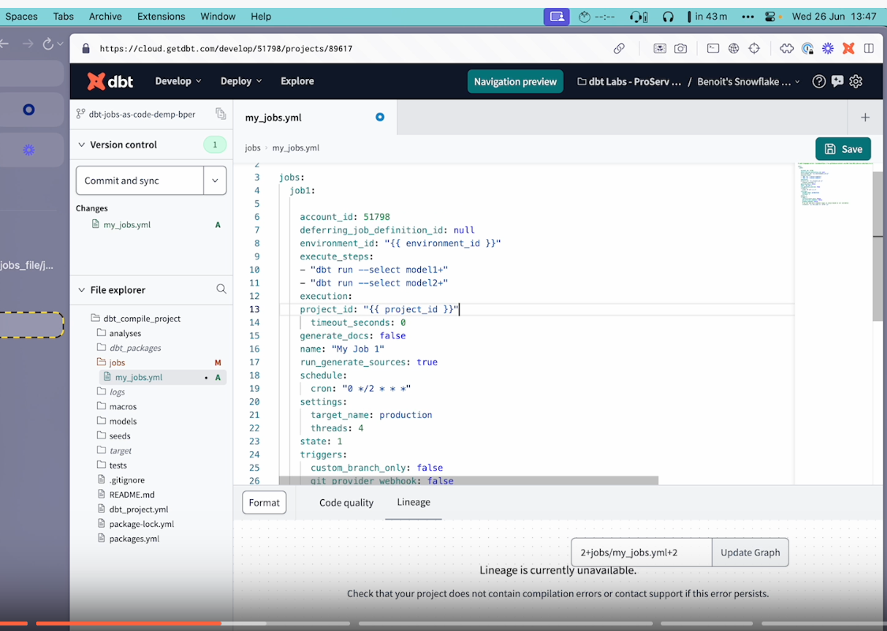

# dbt-jobs-as-code

`dbt-jobs-as-code` is a tool built to handle dbt Cloud Jobs as a well-defined YAML file. Being standard YAML, it is possible to use YAML anchors to reduce duplicate configuration across jobs.

There is also a templating capability to use the same YAML file to update different dbt Cloud projects and/or environments (see [templating](#templating-jobs-yaml-file)).

A given dbt Cloud project can use both jobs-as-code and jobs-as-ui at the same time, without any conflict.

The way we differentiate jobs defined from code from the ones defined from the UI is that the code ones have a name ending with `[[<identifier>]]`.

⚠️ Important: If you plan to use this tool but have existing jobs ending with `[[...]]` you should rename them before running any command.

Below is a demonstration of how to use dbt-jobs-as-code as part of CI/CD, leveraging the new templating features.

[!](https://www.loom.com/share/7c263c560d2044cea9fc82ac8ec125ea?sid=4c2fe693-0aa5-4021-9e94-69d826f3eac5)

## Why not Terraform

Terrraform is widely used to manage infrastructure as code. And a comprehensive [Terraform provider](https://registry.terraform.io/providers/dbt-labs/dbtcloud/latest) exists for dbt Cloud, able to manage dbt Cloud jobs (as well as most of the rest of the dbt Cloud configuration like projects, environments, warehouse connections etc...).

Terraform is much more powerful but using it requires some knowledge about the tool and requires managing/storing/sharing a state file, containing information about the state of the application.

With this package's approach, people don't need to learn another tool and can configure dbt Cloud using YAML, a language used across the dbt ecosystem:

- **no state file required**: the link between the YAML jobs and the dbt Cloud jobs is stored in the jobs name, in the `[[<identifier>]]` part
- **YAML**: dbt users are familiar with YAML and we created a JSON schema allowing people to verify that their YAML files are correct
- by using filters like `--project-id`, `--environment-id` or `--limit-projects-envs-to-yml` people can limit the projects and environments checked by the tool, which can be used to "promote" jobs between different dbt Cloud environments

## Usage

### Installation

- Create a Python virtual environment and activate it
- Run `pip install dbt-jobs-as-code` (or `pip install dbt-jobs-as-code~=0.7` to install a specific release and its patches)

The CLI is now available as `dbt-jobs-as-code`

### Pre-requisites

The following environment variables are used to run the code:

- `DBT_API_KEY`: [Mandatory] The dbt Cloud API key to interact with dbt Cloud. Can be a Service Token (preferred, would require the "job admin" scope) or the API token of a given user
- `DBT_BASE_URL`: [Optional] By default, the tool queries `https://cloud.getdbt.com`, if your dbt Cloud instance is hosted on another domain, define it in this env variable (e.g. `https://emea.dbt.com`)

### Commands

The CLI comes with a few different commands

#### `validate`

Command: `dbt-jobs-as-code validate <config_file.yml>`

Validates that the YAML file has the correct structure

- it is possible to run the validation offline, without doing any API call
- or online using `--online`, in order to check that the different IDs provided are correct
- it supports templating the jobs YAML file (see [templating](#templating-jobs-yaml-file))

#### `plan`

Command: `dbt-jobs-as-code plan <config_file.yml>`

Returns the list of actions create/update/delete that are required to have dbt Cloud reflecting the configuration file

- this command doesn't modify the dbt Cloud jobs
- this command can be restricted to specific projects and environments
  - it accepts a list of project IDs or environments IDs to limit the command for: `dbt-jobs-as-code plan <config_file.yml> -p 1234 -p 2345 -e 4567 -e 5678`
    - it is possible to limit for specific projects and/or specific environments
    - when both projects and environments are provided, the command will run for the jobs that are both part of the environment ID(s) and the project ID(s) provided
  - or it accepts the flag `--limit-projects-envs-to-yml` to only check jobs that are in the projects and environments listed in the jobs YAML file
- it supports templating the jobs YAML file (see [templating](#templating-jobs-yaml-file))

#### `sync`

Command: `dbt-jobs-as-code sync <config_file.yml>`

Create/update/delete jobs and env vars overwrites in jobs to align dbt Cloud with the configuration file

- ⚠️ this command will modify your dbt Cloud jobs if the current configuration is different from the YAML file
- this command can be restricted to specific projects and environments
  - it accepts a list of project IDs or environments IDs to limit the command for: `dbt-jobs-as-code sync <config_file.yml> -p 1234 -p 2345 -e 4567 -e 5678`
    - it is possible to limit for specific projects and/or specific environments
  environment ID(s) and the project ID(s) provided
  - or it accepts the flag `--limit-projects-envs-to-yml` to only check jobs that are in the projects and environments listed in the jobs YAML file
- it supports templating the jobs YAML file (see [templating](#templating-jobs-yaml-file))

#### `import-jobs`

Command: `dbt-jobs-as-code import-jobs --config <config_file.yml>` or `dbt-jobs-as-code import-jobs --account-id <account-id>`

Queries dbt Cloud and provide the YAML definition for those jobs. It includes the env var overwrite at the job level if some have been defined

- it is possible to restrict the list of dbt Cloud Job IDs by adding `... -j 101 -j 123 -j 234`
- this command also accepts a list of project IDs or environments IDs to limit the command for: `dbt-jobs-as-code sync <config_file.yml> -p 1234 -p 2345 -e 4567 -e 5678`
- once the YAML has been retrieved, it is possible to copy/paste it in a local YAML file to create/update the local jobs definition.

To move some ui-jobs to jobs-as-code, perform the following steps:

- run the command to import the jobs
- copy paste the job/jobs into a YAML file
- change the `import_` id of the job in the YAML file to another unique identifier
- rename the job in the UI to end with `[[new_job_identifier]]`
- run a `plan` command to verify that no changes are required for the given job

#### `unlink`

Command: `dbt-jobs-as-code unlink --config <config_file.yml>` or `dbt-jobs-as-code unlink --account-id <account-id>`

Unlinking jobs removes the `[[ ... ]]` part of the job name in dbt Cloud.

⚠️ This can't be rolled back by the tool. Doing a `unlink` followed by a `sync` will create new instances of the jobs, with the `[[<identifier>]]` part

- it is possible to restrict the list of jobs to unlink by adding the job identifiers to unlink `... -i import_1 -i my_job_2`

#### `deactivate-jobs`

Command: `dbt-jobs-as-code deactivate-jobs --account-id 1234 --job-id 12 --job-id 34 --job-id 56`

This command can be used to deactivate both the schedule and the CI triggers for dbt Cloud jobs. This can be useful when moving jobs from one project to another. When the new jobs have been created, this command can be used to deactivate the jobs from the old project.

### Job Configuration YAML Schema

The file `src/schemas/load_job_schema.json` is a JSON Schema file that can be used to verify that the YAML config files syntax is correct and to provide completion suggestions for the different fields supported.

To use it in VSCode, install [the extension `YAML`](https://marketplace.visualstudio.com/items?itemName=redhat.vscode-yaml) and add the following line at the top of your YAML config file (change the path if need be):

```yaml
# yaml-language-server: $schema=https://raw.githubusercontent.com/dbt-labs/dbt-jobs-as-code/main/src/schemas/load_job_schema.json
```

### Templating jobs YAML file

`validate`, `sync` and `plan` support templating the YML jobs file since version 0.6.0

To do so:

- update the jobs YAML file by setting some values as Jinja variables
  - e.g `project_id: {{ project_id }}` or `environment_id: {{ environment_id }}`
- and add the parameter `--vars-yml` (or `-v`) pointing to a YAML file containing values for your variables

The file called in `--vars-yml` needs to be a valid YAML file like the following:

```yml
project_id: 123
environment_id: 456
```

There are some example of files under `example_jobs_file/jobs_templated...`. Those examples also show how we can use Jinja logic to set some parameters based on our variables.

When using templates, you might also want to use the flag `--limit-projects-envs-to-yml`. This flag will make sure that only the projects and environments of the rendered YAML files will be checked to see what jobs to create/delete/update.

Templating also allows people to version control those YAML files and to have different files for different development layers, like:

- `dbt-jobs-as-code jobs.yml --vars-yml vars_qa.yml --limit-projects-envs-to-yml` for QA
- `dbt-jobs-as-code jobs.yml --vars-yml vars_prod.yml --limit-projects-envs-to-yml` for Prod

The tool will raise errors if:

- the jobs YAML file provided contains Jinja variables but `--vars-yml` is not provided
- the jobs YAML file provided contains Jinja variables that are not listed in the `--vars-yml` file

### Summary of parameters

| Command         | `--project-id` / `-p` | `--environment-id` / `-e` | `--limit-projects-envs-to-yml` / `-l` | `--vars-yml` / `-v` | `--online` | `--job-id` / `-j` | `--identifier` / `-i` | `--dry-run` |
| --------------- | :-------------------: | :-----------------------: | :-----------------------------------: | :-----------------: | :--------: | :---------------: | :-------------------: | :---------: |
| plan            |          ✅           |            ✅             |                  ✅                   |         ✅          |            |                   |                       |             |
| sync            |          ✅           |            ✅             |                  ✅                   |         ✅          |            |                   |                       |             |
| validate        |                       |                           |                                       |         ✅          |     ✅     |                   |                       |             |
| import-jobs     |          ✅           |            ✅             |                                       |                     |            |        ✅         |                       |             |
| unlink          |                       |                           |                                       |                     |            |                   |          ✅           |     ✅      |
| deactivate-jobs |                       |                           |                                       |                     |            |        ✅         |                       |             |

As a reminder using `--project-id` and/or `--environment-id` is not compatible with using `--limit-projects-envs-to-yml`.
We can only restricts by providing the IDs or by forcing to restrict on the environments and projects in the YML file.

## Running the tool as part of CI/CD

An example of GitHub Action is provided in the [example_cicd folder](https://github.com/dbt-labs/dbt-jobs-as-code/blob/HEAD/example_cicd). This example requires having set the GitHub secret `DBT_API_KEY`.

You can copy/paste thie file in your own repo under `.github/workflows`. The current script except your jobs `yml` file to be saved under `jobs/jobs.yml`

After a PR on `main` is approved, the action will run a `sync` to compare the local `yml` file with the dbt Cloud configuration and will create/update/delete dbt Cloud jobs to align the two.

## Reporting bugs and contributing code

- Want to report a bug or request a feature? Let us know by opening [an issue](https://github.com/dbt-labs/dbt-jobs-as-code/issues/new)
- Want to help us build dbt? Check out the [Contributing Guide](https://github.com/dbt-labs/dbt-jobs-as-code/blob/HEAD/CONTRIBUTING.md)
