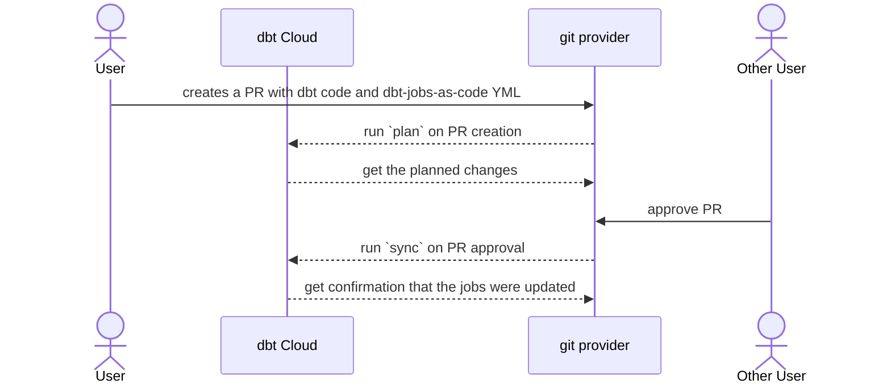
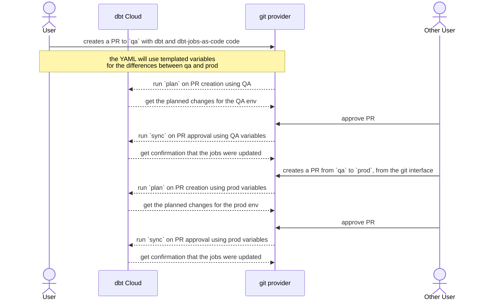
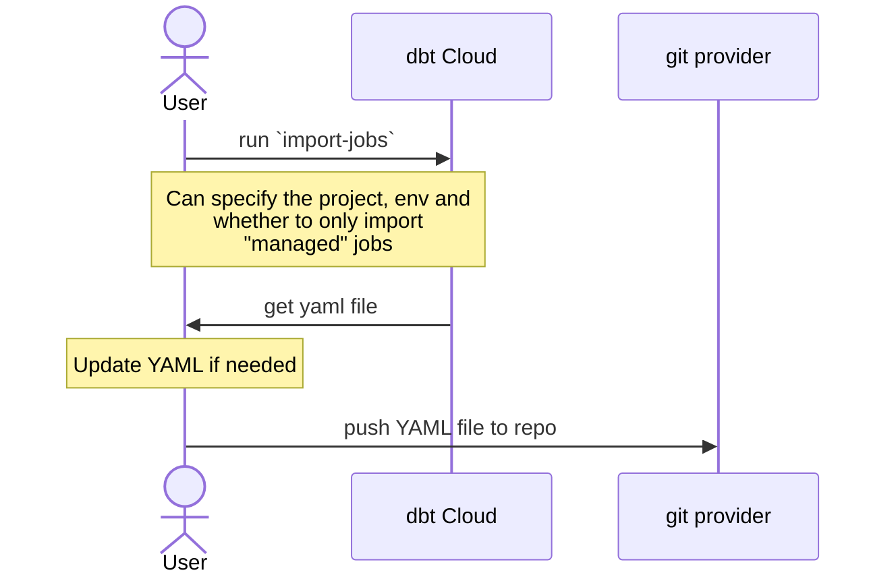
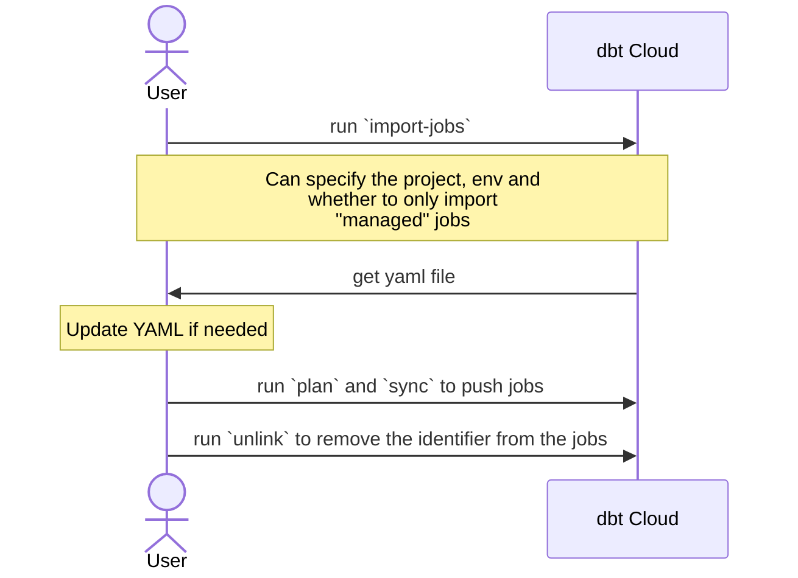
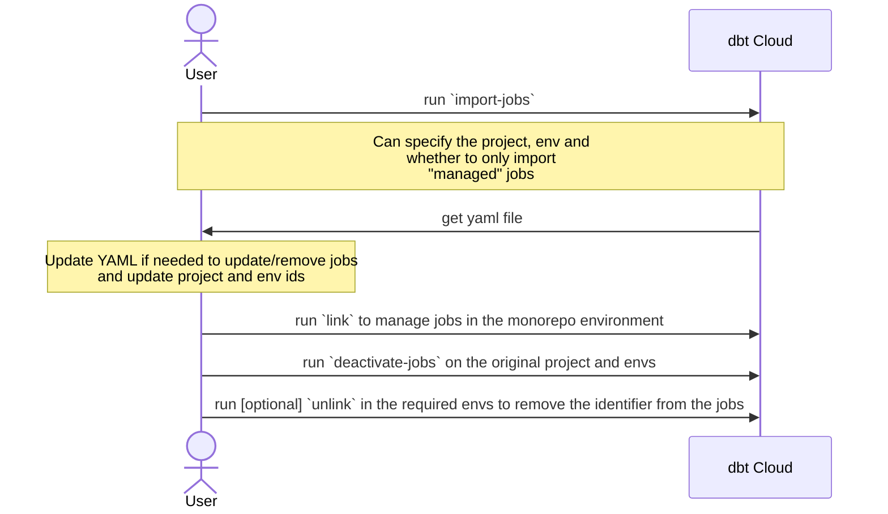
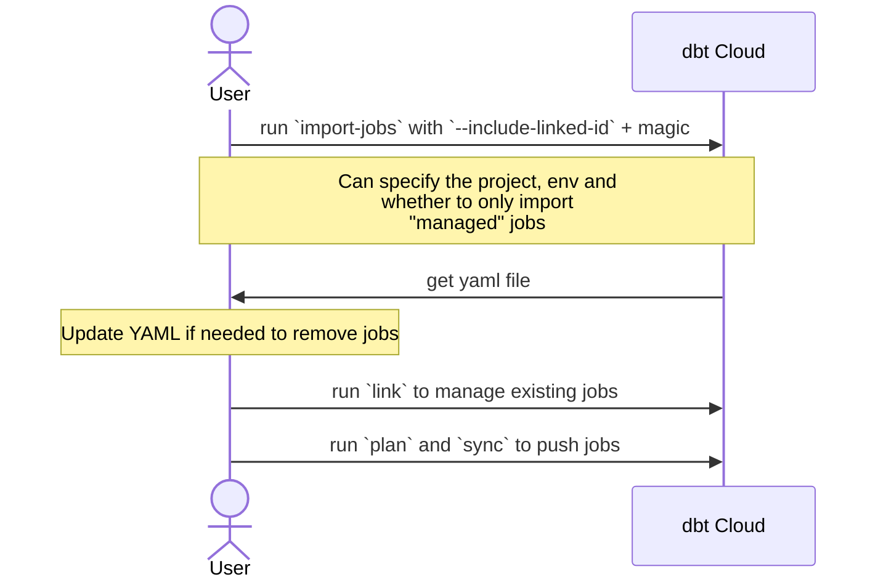

# Typical flows (WIP)

This page descibes how `dbt-jobs-as-code` can be used in different scenarios, what commands to run in what order, what parameters to use, what CI actions to create etc...

## Manage jobs as code only for Production

In the most basic case, people maintain their jobs YAML files in their git repository and configure some CI action to trigger: 

- a `plan` on PR creation to get a feedback of the planned changes
- a `sync` on PR approval to apply the changes to production



The relevant GitHub actions would be the following:

```yaml title="plan_on_pr.yml"
name: Plan for syncing dbt Cloud Jobs from YAML
run-name: Running dbt-jobs-as-code plan to see what is going to be changed/deleted

on:
  pull_request:
    branches:
      - main
    paths:
      - 'jobs/**'

jobs:
  run-python-script:
    runs-on: ubuntu-latest
    steps:
      - name: Check out repository code
        uses: actions/checkout@v4

      - name: Set up Python
        uses: actions/setup-python@v4
        with:
          python-version: "3.12.x"

        - name: Install a specific version of uv
          uses: astral-sh/setup-uv@v5
          with:
            version: "0.5"

      - name: Run dbt-jobs-as-code
        run: uvx dbt-jobs-as-code plan jobs/my_jobs.yml # we could also force a version with uvx dbt-jobs-as-code@1.2
        env: 
          DBT_API_KEY: "${{secrets.DBT_API_KEY}}"
          # DBT_BASE_URL is optional
          # DBT_BASE_URL: "${{secrets.DBT_BASE_URL}}"

```

```yaml title="sync_on_pr_closed.yml"
name: Replicate dbt Cloud Jobs from YAML
run-name: Running dbt-jobs-as-code sync to replicate dbt Cloud jobs from YAML

on:
  pull_request:
    types:
      - closed
    branches:
      - main
    paths:
      - 'jobs/**'

jobs:
  run-python-script:
    if: github.event.pull_request.merged == true
    runs-on: ubuntu-latest
    steps:
      - name: Check out repository code
        uses: actions/checkout@v4

      - name: Set up Python
        uses: actions/setup-python@v4
        with:
          python-version: "3.12.x"

        - name: Install a specific version of uv
          uses: astral-sh/setup-uv@v5
          with:
            version: "0.5"

      - name: Run dbt-jobs-as-code
        run: uvx dbt-jobs-as-code sync jobs/my_jobs.yml # we could also force a version with uvx dbt-jobs-as-code@1.2
        env: 
          DBT_API_KEY: "${{secrets.DBT_API_KEY}}"
          # DBT_BASE_URL is optional
          # DBT_BASE_URL: "${{secrets.DBT_BASE_URL}}"
```

---

## Manage jobs as code in different environments

A similar approach to the first case, but in that situation, we use [templated YML files](/advanced_config/templating/) so that the same YML file can be used across different environments, and jobs can be configured based on some variables.

In that case, both promotion to QA and promotion to Prod will trigger a `plan` on PR creation and a `sync` on PR approval.




The GitHub action is now a bit more complex to manage any number of promotion environments.

By updating `BRANCH_FILE_MAP`, we can map different branches of our different environments to different variable files.

The example below is just for `plan` on PR creation, but the same logic would apply for `sync` on PR approval.

```yaml title="plan_on_pr.yml"
name: Plan for syncing dbt Cloud Jobs from YAML
run-name: Running dbt-jobs-as-code plan to see what is going to be changed/deleted

on:
  pull_request:
    branches:
      - '**'  # Trigger on all branches
    paths:
      - 'jobs/**' # we only trigger when files change under the `jobs/` folder which is where we store our config

env:
  BRANCH_FILE_MAP: |
    {
      "main": "jobs/vars_prod.yml",
      "qa": "jobs/vars_qa.yml"
    }

jobs:
  run-python-script:
    runs-on: ubuntu-latest
    steps:
      - name: Check out repository code
        uses: actions/checkout@v4

      - name: Set up Python
        uses: actions/setup-python@v4
        with:
          python-version: "3.12.x"

      - name: Install a specific version of uv
          uses: astral-sh/setup-uv@v5
          with:
            version: "0.5"

      - name: Set vars file based on branch
        id: set-vars-file
        run: |
          target_branch="${{ github.base_ref }}"
          vars_file=$(echo '${{ env.BRANCH_FILE_MAP }}' | jq -r --arg branch "$target_branch" '.[$branch] // empty')
          
          if [[ -z "$vars_file" ]]; then
            echo "Branch $branch not found in BRANCH_FILE_MAP. Exiting."
            exit 0  # Exit gracefully if branch is not in the map
          fi

          echo "vars_file=$vars_file" >> $GITHUB_OUTPUT

      - name: Run dbt-jobs-as-code
        if: steps.set-vars-file.outputs.vars_file != ''  # Only run if vars_file is set
        run: uvx dbt-jobs-as-code plan jobs/jobs.yml --vars-yml ${{ steps.set-vars-file.outputs.vars_file }} --limit-projects-envs-to-yml
        env: 
          DBT_API_KEY: "${{secrets.DBT_API_KEY}}"

```

---

## Initial import of jobs

The `import-jobs` command can be used to import jobs from dbt Cloud to a YAML file. Once the YAML file has been created it can be pushed to a git repository and jobs can be managed as code as in the previous cases.

The developer would just run `dbt-jobs-as-code import-jobs` and decide the parameters for the import:

- `--project-id`: the project to import the jobs from
- `--environment-id`: the environment to import the jobs from
- `--include-linked-id`: whether to include the linked id in the jobs
- `--only-managed`: whether to only import "managed" jobs and leave the other one to be still managed via the UI in dbt Cloud

Once the YAML file has been created, it can be modified to remove jobs or change some parameters to replace them by variables.



---

## Replicate jobs from one environment to another (once off)

In the case that the requirement is only to replicate some or all jobs as a once off, a developer could run a few different commands without pushing the YAML file to a git repository.



---

## Move all jobs from one environment to another

This flow can be useful for people who want to move all jobs from one environment/project to another. This can happen for example when going from a monorepo to a dbt-mesh and wanting to move some/all the jobs to the new dbt Cloud project.



---

## **WIP -- Not implemented yet** // Replicate all jobs from one environment to another (ongoing managed jobs)


